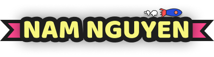

  

<h3 align="center"><samp>Hi there 🌸 I am <b><a rel="nofollow noopener noreferrer" target="_blank" href="https://namnguyen.in/">Nam</a></b></samp></h3>

 
  <samp>
    ▞ React Developer ❄️ ▚  
    ▞ Compter Science Student @ 🌻 <b>Deakin Unversity</b> ▚  
  </samp>

   
 <samp>Learn more about me 😆</samp>

   
 
      <samp>
         
         
         
         
         
         
         
         
          
          
         <!--
         <a rel="nofollow noopener noreferrer" target="_blank" href="https://github-readme-stats.vercel.app/api?username=nnfunny&show_icons=true&hide_border=true&hide=issues&theme=tokyonight" >Gitub Stats</a>
          -->
      </samp>
        
<samp>My favorite quote: “The only constant is change” - The Greek philosopher Heraclitus 🍀</samp>

        
<samp>I'm passionate about 🕸 web development (React). </samp>
  
        
<samp>I'm currently learning more about 👾 2D game development and 🌈 computer graphics.</samp>

        
<samp>I'd love to collaborate on web, game and computer graphics projects. 🤝</samp>

   

  ════ 𐫰 ════  
  <samp>Thanks for visiting my repository. Take care, stay safe and be happy. 😊</samp>

